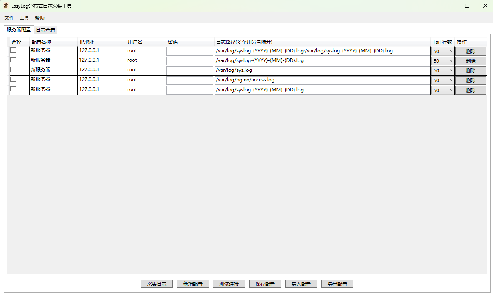

# EasyLog 分布式日志采集工具 - 使用说明

## 概述
EasyLog 是一款分布式日志采集工具，支持从多台服务器批量采集日志并集中查看。界面友好，操作简便。

## 软件下载
[官方下载](https://github.com/data2/easy-log-tools/releases/download/v1.0.0/EasyLog.exe)

## 功能特性

- **多服务器管理**：支持添加、编辑、删除服务器配置
- **批量日志采集**：可同时从多台服务器采集日志
- **灵活配置**：支持自定义日志路径、采集行数等参数
- **日志筛选**：支持按服务器IP和关键词筛选日志
- **配置导入导出**：方便配置的备份和迁移

## 界面说明

### 主界面布局


1. **顶部菜单栏**：提供文件、工具、帮助等功能入口
2. **配置选项卡**：包含"服务器配置"和"日志查看"两个标签页

### 服务器配置页
- **服务器列表**：显示所有已配置的服务器信息
  - 选择框：勾选需要操作的服务器
  - 配置名称：自定义的服务器标识
  - IP地址：服务器IP或域名
  - 用户名/密码：登录凭证
  - 日志路径：支持多个路径，用分号(;)隔开
  - Tail行数：选择采集的日志行数(50/100/300/500/1000)
  - 操作：删除当前配置

- **操作按钮**：
  - 采集日志：从选中的服务器采集日志
  - 新增配置：添加新的服务器配置
  - 测试连接：验证服务器连接是否正常
  - 保存配置：保存当前所有配置
  - 导入/导出配置：从文件导入或导出配置

### 日志查看页
- **搜索栏**：
  - 服务器筛选：按IP筛选日志
  - 关键词搜索：输入关键词过滤日志内容

- **日志列表**：
  - 服务器IP：显示日志来源
  - 时间：日志时间戳
  - 日志内容：实际的日志信息

## 使用指南

### 1. 添加服务器配置
1. 点击"新增配置"按钮
2. 填写服务器信息：
   - 配置名称：自定义名称(如"生产环境Web服务器")
   - IP地址：服务器IP
   - 用户名/密码：SSH登录凭证
   - 日志路径：如"/var/log/nginx/error.log;/var/log/messages"
   - Tail行数：选择需要采集的日志行数
3. 点击"保存配置"按钮

### 2. 测试服务器连接
1. 勾选要测试的服务器
2. 点击"测试连接"按钮
3. 查看测试结果提示

### 3. 采集日志
1. 勾选要采集日志的服务器
2. 点击"采集日志"按钮
3. 切换到"日志查看"标签页查看结果

### 4. 筛选日志
1. 在"日志查看"页：
   - 使用服务器IP下拉框选择特定服务器
   - 在搜索框输入关键词过滤日志内容
2. 点击"搜索"按钮应用筛选

### 5. 配置管理
- **导出配置**：将当前所有服务器配置导出为文件
- **导入配置**：从文件导入服务器配置

## 注意事项

1. 确保服务器已开启SSH服务
2. 配置的账号需要有读取日志文件的权限
3. 密码字段在界面中会以密文显示
4. 长时间不操作可能会因会话超时导致连接失败

## 常见问题

**Q：连接测试失败怎么办？**
A：请检查：
- 服务器IP是否正确
- SSH服务是否正常运行
- 防火墙是否放行了SSH端口(默认22)
- 用户名密码是否正确

**Q：采集不到日志怎么办？**
A：请检查：
- 日志路径是否正确
- 指定用户是否有权限读取日志文件
- 服务器磁盘空间是否充足

**Q：如何采集多个日志文件？**
A：在日志路径中用英文分号(;)分隔多个路径，如：
```
/var/log/nginx/access.log;/var/log/nginx/error.log
```

## 版本信息

当前版本：v1.0.0  
